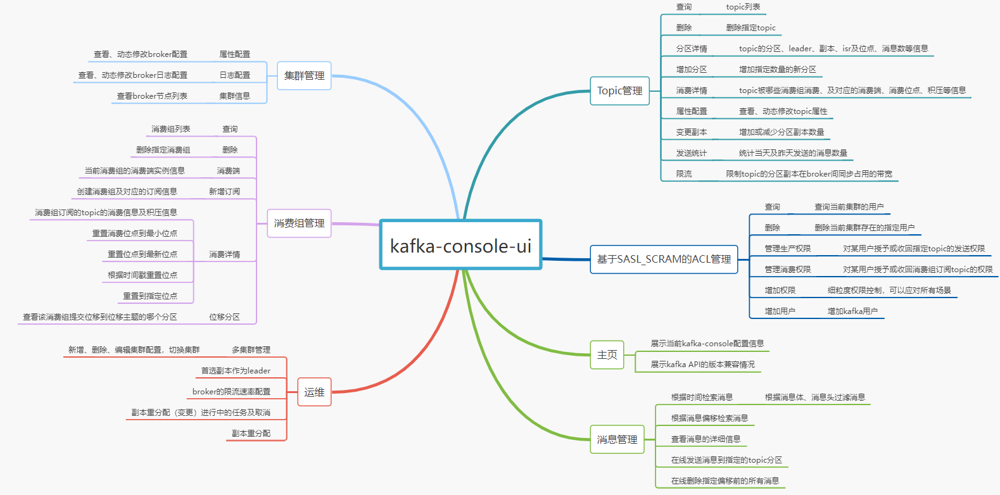

# kafka可视化管理平台
一款轻量级的kafka可视化管理平台，安装配置快捷、简单易用。  
为了开发的省事，没有国际化支持，页面只支持中文展示。  
用过rocketmq-console(rocketmq-dashboard)吧，对，前端展示风格跟那个有点类似。

## 页面预览
如果github能查看图片的话，可以点击[查看菜单页面](./document/overview/概览.md)，查看每个页面的样子
## 集群迁移支持说明
当前主分支及日后版本不再提供消息同步、集群迁移的解决方案，如有需要，查看：[集群迁移说明](./document/datasync/集群迁移.md)
## ACL说明
最新代码运行即可看到acl菜单，将权限管理和认证的用户管理（SASL_SCRAM)进行了分离。分离之后，支持只开启SASL_SCRAM认证的时候（未开启鉴权），用户变更操作。或者使用其它认证机制下的权限管理操作（可视化的权限管理），但是可视化的认证用户管理目前只支持Scram。

v1.0.6版本之前，如果kafka集群启用了ACL，但是控制台没看到Acl菜单，可以查看：[Acl配置启用说明](./document/acl/Acl.md)
## 功能支持
* 多集群支持
* 集群信息
* Topic管理
* 消费组管理
* 消息管理
* ACL
* 客户端限流
* 运维

功能明细看这个脑图：


## 安装包下载
点击下载(v1.0.13版本)：[kafka-console-ui.zip](https://github.com/xxd763795151/kafka-console-ui/releases/download/v1.0.13/kafka-console-ui-1.0.13.zip)  

如果安装包下载的比较慢，可以查看下面的源码打包说明，把代码下载下来，本地快速打包.  

github下载慢也可以试试从gitee下载，点击下载[gitee来源kafka-console-ui.zip](https://gitee.com/xiaodong_xu/kafka-console-ui/releases/download/v1.0.13/kafka-console-ui-1.0.13.zip)

## 快速使用
### Windows
1. 解压缩zip安装包  
2. 进入bin目录, 双击执行`start.bat`启动; 如果使用PowerShell, 也可以选择运行`start.ps1`启动
3. 停止：直接关闭启动的命令行窗口即可

### Linux或Mac OS
```
# 解压缩
unzip kafka-console-ui.zip
# 进入解压缩后的目录
cd kafka-console-ui
# 启动
sh bin/start.sh
# 停止
sh bin/shutdown.sh
```

### 访问地址
启动完成，访问：http://127.0.0.1:7766

### 配置集群
第一次启动，打开浏览器后，因为还没有配置kafka集群信息，所以页面右上角可能会有错误信息，比如：No Cluster Info或者是没有集群信息，请先切换集群之类的提示。  

集群配置如下：
1. 点击页面上方导航栏的 [运维] 菜单
2. 点击集群管理下的 [集群切换] 按钮
3. 在弹框里点击 [新增集群]
4. 然后输入kafka集群地址和一个名称（随便起个名字）
5. 点击提交便增加成功了
6. 增加成功可以看到会话框已经有这个集群信息，然后点击右侧的 [切换] 按钮，便切换该集群为当前集群  

后续如果再增加其它集群，就可以按上面这个流程，如果想切换到哪个集群，点击切换按钮，便会切换到对应的集群，页面的右上角会显示当前是使用的哪个集群，如果不确定，可以刷新下页面。

在新增集群的时候，除了集群地址还可以输入集群的其它属性配置，比如请求超时，ACL配置等。如果开启了ACL，切换到该集群的时候，导航栏上便会出现ACL菜单，支持进行相关操作（目前是基于SASL_SCRAM认证授权管理支持的最完善，其它的我也没验证过，虽然是我开发的，但是我也没具体全部验证这一块功能，授权部分应该是通用的）

## kafka版本
* 当前使用的kafka 3.5.0
## 监控
仅提供运维管理功能，监控、告警需要配合其它组件，如有需要，建议请查看：https://blog.csdn.net/x763795151/article/details/119705372

## 源码打包
如果想通过源码打包，查看：[源码打包说明](./document/package/源码打包.md)

## 本地开发
如果需要本地开发，开发环境配置查看：[本地开发](./document/develop/开发配置.md)

## 登录认证和权限
1.0.7版本及之前，主分支不支持登录认证，感谢@dongyinuo 同学开发了一版支持登录认证，及相关的按钮权限（主要有两个角色：管理员和普通开发人员）。  
在分支：feature/dongyinuo/20220501/devops 上。  
如果有需要使用管理台登录认证的，可以切换到这个分支上进行打包，打包方式看 源码打包 说明。  
默认登录账户：admin/kafka-console-ui521

目前最新版本主分支已增加登录认证、用户、角色等权限配置，如需开启登录认证，修改配置文件config/application.yml: auth.enable=true(默认 false)，如下：
```yaml
# 权限认证设置，设置为true，需要先登录才能访问
auth:
  enable: true
  # 登录用户token的过期时间，单位：小时
  expire-hours: 24
```
默认有两个登录用户：super-admin/123456，admin/123456，登录成功后在个人设置修改密码。super-admin和admin的唯一区别是super-admin可以增加删除用户，admin不能。如果觉得不合适，请在用户菜单下删除相关用户或角色自行创建合适的角色或用户。
注意：不开启登录认证，页面不显示用户菜单，正常现象。


## DockerCompose部署
感谢@wdkang123 同学分享的部署方式，如果有需要请查看[DockerCompose部署方式](./document/deploy/docker部署.md)
## 感谢支持
感谢jetbrains的开源支持，如果有朋友愿意一起维护，很欢迎提pr.

[](https://jb.gg/OpenSourceSupport)

jetbrains官方地址: https://www.jetbrains.com/
## 联系方式
+ 微信群


[//]: # ()

抱歉，后面就不再提供新的联系方式加群了。  

在很早之前，有个兄弟提了个建议，可以拉个群，大家可以一起交流，所以成立了一个群，当时我以为没有多少朋友愿意加入。  

可是后来确实有不少朋友进群了，这让我很惶恐，其实这个平台我自己并不觉得有太多技术深度，却有一些朋友愿意来捧场，这个让我觉得很惭愧，所以现在考虑了下，如果真有使用问题，可以留个issue。  

另外，我自己也确实挺忙，对于这个项目的需求处理不够及时，实在是时间和精力上有限，所以有朋友希望新增的一些能力，拖了这么久我也没有下文，实在是抱歉。

对于一些不太耗时的功能，我还是可以积极处理的。

另外有些功能，是想要放到后面再加的，所以迟迟没有动手。
