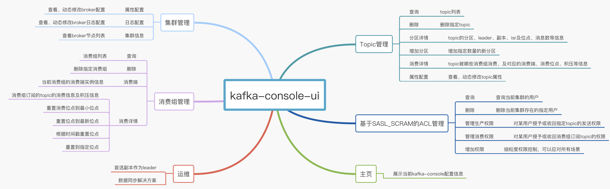

# kafka可视化管理平台
一款轻量级的kafka可视化管理平台，安装配置快捷、简单易用。  
为了开发的省事，没有多语言支持，只支持中文展示。  
用过rocketmq-console吧，对，前端展示风格跟那个有点类似。
## 安装包下载
* 点击下载：[kafka-console-ui.tar.gz](http://43.128.31.53/kafka-console-ui.tar.gz) 或 [kafka-console-ui.zip](http://43.128.31.53/kafka-console-ui.zip)
* 参考下面的打包部署，下载源码重新打包  
## 功能支持
* 集群信息
* Topic管理
* 消费组管理
* 基于SASL_SCRAM认证授权管理
* 运维

## 技术栈
* spring boot 
* java、scala 
* kafka
* h2  
* vue 
## kafka版本
* 当前使用的kafka 2.8.0
## 监控
仅提供运维管理功能，监控、告警需要配合其它组件，使用请查看：https://blog.csdn.net/x763795151/article/details/119705372
# 打包、部署
## 打包
环境要求  
* maven 3.6+
* jdk 8
* git  
```
git clone https://github.com/xxd763795151/kafka-console-ui.git
cd kafka-console-ui
# linux或mac执行
sh package.sh
# windows执行
package.bat
```
打包成功，输出文件(以下2种归档类型)：  
* target/kafka-console-ui.tar.gz  
* target/kafka-console-ui.zip  
## 部署
### Mac OS 或 Linux
```
# 解压缩(以tar.gz为例)
tar -zxvf kafka-console-ui.tar.gz
# 进入解压缩后的目录
cd kafka-console-ui
# 编辑配置
vim config/application.yml
# 启动
sh bin/start.sh
# 停止
sh bin/shutdown.sh
```
### Windows
1.解压缩zip安装包  
2.编辑配置文件 ：`config/application.yml`  
3.进入bin目录（必须在bin目录下），执行`start.bat`启动  

启动完成，访问：http://127.0.0.1:7766  

5.启动  
```shell script
java -jar target/kafka-console-ui.jar
```
6.启动完成，访问：http://127.0.0.1:7766  
# 开发环境
* jdk 8
* idea
* scala 2.13
* maven >=3.6+
* webstorm
除了webstorm是开发前端的ide可以根据自己需要代替，jdk scala是必须有的。
# 本地开发配置
以我自己为例，开发环境里的工具准备好，然后代码clone到本地。
## 后端配置
1. 用idea打开项目
2. 打开idea的Project Structure(Settings) ->  Modules -> 设置src/main/scala为Sources，因为约定src/main/java是源码目录，所以这里要再加一个
3. 打开idea的Project Structure(Settings) -> Libraries 添加scala sdk，然后选择本地下载的scala 2.13的目录，确定添加进来
## 前端
前端代码在工程的ui目录下，找个前端开发的ide打开进行开发即可。
## 注意
前后分离，直接启动后端如果未编译前端代码是没有前端页面的，可以先打包进行编译`sh package.sh`，然后再用idea启动，或者前端部分单独启动  