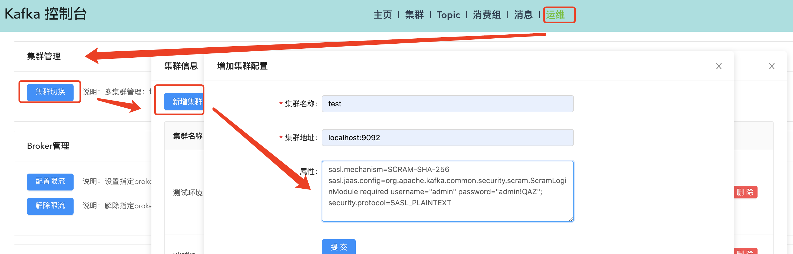

# Acl配置启用说明
## 前言
可能有的同学是看了这篇文章来的：[如何通过可视化方式快捷管理kafka的acl配置](https://blog.csdn.net/x763795151/article/details/120200119)

这篇文章里可能说了是通过修改配置文件application.yml的方式来启用ACL，示例如下：
```yaml
kafka:
  config:
    # kafka broker地址，多个以逗号分隔
    bootstrap-server: 'localhost:9092'
    # 服务端是否启用acl，如果不启用，下面的几项都忽略即可
    enable-acl: true
    # 只支持2种安全协议SASL_PLAINTEXT和PLAINTEXT，启用acl则设置为SASL_PLAINTEXT，不启用acl不需关心这个配置
    security-protocol: SASL_PLAINTEXT
    sasl-mechanism: SCRAM-SHA-256
    # 超级管理员用户名，在broker上已经配置为超级管理员
    admin-username: admin
    # 超级管理员密码
    admin-password: admin
    # 启动自动创建配置的超级管理员用户
    admin-create: true
    # broker连接的zk地址
    zookeeper-addr: localhost:2181
    sasl-jaas-config: org.apache.kafka.common.security.scram.ScramLoginModule required username="${kafka.config.admin-username}" password="${kafka.config.admin-password}";
```
其中说明了kafka.config.enable-acl配置项需要为true。

注意：**现在不再支持这种方式了**
## v1.0.6之前的版本说明
因为现在支持多集群配置，关于多集群配置，可以看主页说明的 配置集群 介绍。
所以这里把这些额外的配置项都去掉了。

如果启用了ACL，在页面上新增集群的时候，在属性里配置集群的ACL相关信息，如下：
如果控制台检测到属性里有ACL相关属性配置，切换到这个集群后，ACL菜单会自动出现的。

注意：只支持SASL。